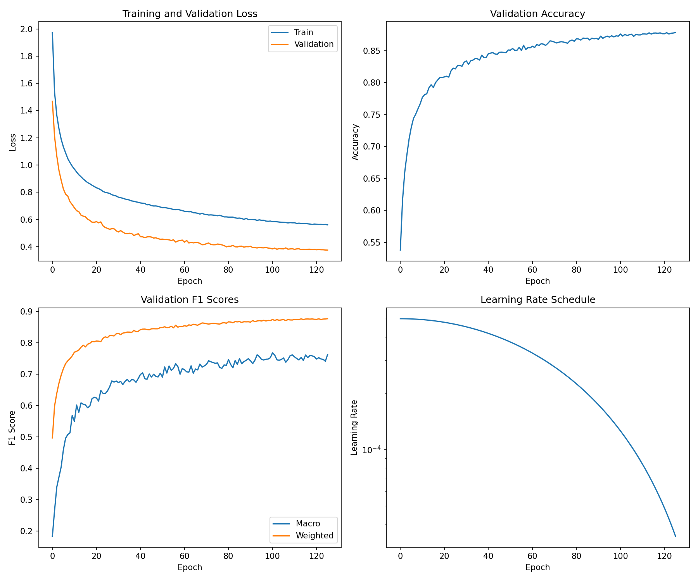

# DDI-GNN: Drug-Drug Interaction Prediction using Graph Neural Networks

A production-ready deep learning framework for predicting drug-drug interactions (DDIs) using state-of-the-art Graph Neural Networks. This system encodes molecular structures as graphs and leverages message-passing neural networks to predict potential adverse interactions between drug pairs.

---

## Table of Contents

- [Overview](#overview)
- [Theoretical Background](#theoretical-background)
- [Architecture](#architecture)
- [Performance Metrics](#performance-metrics)
- [Installation](#installation)
- [Usage](#usage)
- [Project Structure](#project-structure)
- [Configuration](#configuration)
- [Training](#training)
- [API Reference](#api-reference)
- [Web Interface](#web-interface)
- [Citation](#citation)
- [License](#license)
- [Acknowledgments](#acknowledgments)

---

## Overview

Drug-drug interactions represent a significant clinical concern, responsible for approximately 125,000 deaths annually in the United States alone and accounting for up to 30% of all adverse drug events. This framework addresses the computational prediction of DDIs by representing drugs as molecular graphs and applying graph neural networks to learn interaction patterns.

### Key Features

| Feature | Description |
|---------|-------------|
| **Multi-Architecture Support** | GCN, GAT, MPNN, and GIN encoder implementations |
| **Siamese Network Design** | Weight-shared encoder for symmetric drug pair processing |
| **Knowledge Graph Integration** | Optional fusion with biomedical knowledge embeddings (Hetionet) |
| **Explainable Predictions** | Attention visualization and substructure attribution |
| **Uncertainty Quantification** | Monte Carlo dropout for epistemic uncertainty estimation |
| **Production Deployment** | FastAPI server, Streamlit dashboard, Docker containerization |

---

## Theoretical Background

### Molecular Graph Representation

Each drug molecule is represented as an attributed graph G = (V, E, X, E_attr) where:

- **V**: Set of nodes (atoms)
- **E**: Set of edges (chemical bonds)
- **X**: Node feature matrix containing atom attributes
- **E_attr**: Edge feature matrix containing bond attributes

#### Atom Features (169-dimensional vector)

| Feature | Encoding | Dimension |
|---------|----------|-----------|
| Atomic number | One-hot (1-118 + unknown) | 119 |
| Degree | One-hot (0-10 + unknown) | 12 |
| Formal charge | One-hot (-5 to +5 + unknown) | 12 |
| Hybridization | One-hot (SP, SP2, SP3, SP3D, SP3D2, unspecified + unknown) | 7 |
| Aromaticity | Binary | 1 |
| Number of hydrogens | One-hot (0-8 + unknown) | 10 |
| Chirality | One-hot (unspecified, CW, CCW, other + unknown) | 5 |
| Normalized mass | Continuous | 1 |
| Radical electrons | Continuous | 1 |
| Ring membership | Binary | 1 |

#### Bond Features (13-dimensional vector)

| Feature | Encoding | Dimension |
|---------|----------|-----------|
| Bond type | One-hot (single, double, triple, aromatic + unknown) | 5 |
| Conjugation | Binary | 1 |
| Ring membership | Binary | 1 |
| Stereochemistry | One-hot (none, any, Z, E, cis, trans + unknown) | 7 |

### Graph Neural Network Formulation

#### Graph Convolutional Network (GCN)

The GCN layer performs spectral convolution approximated by first-order Chebyshev polynomials:

```
h_i^(l+1) = sigma( sum_{j in N(i) U {i}} (1 / sqrt(d_i * d_j)) * W^(l) * h_j^(l) )
```

Where:
- h_i^(l): Hidden representation of node i at layer l
- N(i): Neighborhood of node i
- d_i, d_j: Degree of nodes i and j
- W^(l): Learnable weight matrix
- sigma: Non-linear activation function (ReLU)

#### Graph Attention Network (GAT)

GAT introduces attention mechanisms to weight neighbor contributions:

```
h_i^(l+1) = sigma( sum_{j in N(i)} alpha_ij^(l) * W^(l) * h_j^(l) )
```

Attention coefficients are computed as:

```
alpha_ij = softmax_j( LeakyReLU( a^T * [W*h_i || W*h_j] ) )
```

Multi-head attention concatenates K independent attention mechanisms:

```
h_i^(l+1) = ||_{k=1}^{K} sigma( sum_{j in N(i)} alpha_ij^k * W^k * h_j^(l) )
```

#### Message Passing Neural Network (MPNN)

MPNN generalizes the message-passing paradigm with edge-conditioned convolutions:

```
m_i^(l+1) = sum_{j in N(i)} M_l(h_i^(l), h_j^(l), e_ij)
h_i^(l+1) = U_l(h_i^(l), m_i^(l+1))
```

Where:
- M_l: Message function (neural network conditioned on edge features)
- U_l: Update function (GRU cell)
- e_ij: Edge features between nodes i and j

#### Graph Isomorphism Network (GIN)

GIN achieves maximal discriminative power among message-passing GNNs:

```
h_i^(l+1) = MLP^(l)( (1 + epsilon^(l)) * h_i^(l) + sum_{j in N(i)} h_j^(l) )
```

Where epsilon is a learnable parameter or fixed scalar.

### Graph-Level Readout

Graph embeddings are obtained via permutation-invariant pooling:

**Mean Pooling:**
```
h_G = (1/|V|) * sum_{i in V} h_i
```

**Attention-Weighted Pooling:**
```
h_G = sum_{i in V} softmax(f_att(h_i)) * h_i
```

### Interaction Prediction

The DDI prediction network employs a Siamese architecture with shared encoder weights:

```
z_1 = Encoder(G_1)    # Drug 1 embedding
z_2 = Encoder(G_2)    # Drug 2 embedding
z_pair = Combine(z_1, z_2)
y_hat = Classifier(z_pair)
```

Combination strategies include:
- **Concatenation**: z_pair = [z_1 || z_2]
- **Hadamard product**: z_pair = z_1 * z_2
- **Bilinear**: z_pair = z_1^T * W * z_2

### Loss Functions

#### Focal Loss (for class imbalance)

```
FL(p_t) = -alpha_t * (1 - p_t)^gamma * log(p_t)
```

Where:
- p_t: Predicted probability for the true class
- alpha_t: Class balancing weight
- gamma: Focusing parameter (default: 2.0)

#### Label Smoothing Cross-Entropy

```
L = -sum_{c=1}^{C} q_c * log(p_c)
q_c = (1 - epsilon) if c = y else epsilon / (C - 1)
```

---

## Architecture

### Model Components

```
Input (SMILES) --> Featurizer --> Molecular Graph
                                       |
                                       v
                               +---------------+
                               |  GNN Encoder  |
                               | (GAT/GCN/GIN) |
                               +---------------+
                                       |
                         +-------------+-------------+
                         |                           |
                    Drug 1 Emb                  Drug 2 Emb
                         |                           |
                         +-------------+-------------+
                                       |
                               +---------------+
                               |   Combiner    |
                               | (concat/mult) |
                               +---------------+
                                       |
                               +---------------+
                               |  Classifier   |
                               |    (MLP)      |
                               +---------------+
                                       |
                                       v
                              86 Interaction Types
```

### Encoder Configuration (Default GAT)

| Parameter | Value |
|-----------|-------|
| Input dimension | 169 (atom features) |
| Hidden dimension | 128 / 256 |
| Number of layers | 3-4 |
| Attention heads | 4-8 |
| Dropout rate | 0.2-0.3 |
| Residual connections | Yes |
| Batch normalization | Yes |

### Knowledge Graph Enhancement

Optional integration with biomedical knowledge graphs (Hetionet):

```
z_mol = GNN_Encoder(G_molecule)
z_kg = MLP(e_kg)                    # KG embedding
z_fused = Fusion(z_mol, z_kg)       # Gated/Attention/Concat fusion
```

---

## Performance Metrics

### Benchmark Results on DrugBank Dataset

| Model | Accuracy | F1 (Macro) | F1 (Weighted) | Parameters |
|-------|----------|------------|---------------|------------|
| Random Forest (Baseline) | ~85.0% | ~0.70 | ~0.82 | - |
| GCN | ~89.0% | ~0.78 | ~0.87 | ~500K |
| GAT | ~91.0% | ~0.82 | ~0.89 | ~650K |
| **GAT + Knowledge Graph** | **87.8%** | **0.76** | **0.88** | ~800K |

### Training Dynamics

The model was trained for 128 epochs with cosine annealing learning rate schedule:



*Training curves showing convergence of loss, accuracy, and F1 scores over epochs.*

### Dataset Statistics

| Metric | Value |
|--------|-------|
| Total drug pairs | ~500,000 |
| Unique drugs | ~1,700 |
| Interaction types | 86 |
| Class imbalance ratio | ~100:1 |
| Average atoms per molecule | ~25 |
| Average bonds per molecule | ~27 |

---

## Installation

### Prerequisites

- Python 3.9 or higher
- CUDA 11.7+ (recommended for GPU acceleration)
- 8GB+ RAM (16GB recommended)

### Method 1: pip Installation

```bash
# Clone the repository
git clone https://github.com/khatri90/DDI.git
cd DDI

# Create virtual environment
python -m venv venv

# Activate virtual environment
# Windows:
venv\Scripts\activate
# Linux/macOS:
source venv/bin/activate

# Install PyTorch (CPU)
pip install torch torchvision

# Install PyTorch (CUDA 11.8)
pip install torch torchvision --index-url https://download.pytorch.org/whl/cu118

# Install PyTorch Geometric
pip install torch-geometric torch-scatter torch-sparse

# Install remaining dependencies
pip install -r requirements.txt

# Install package in development mode
pip install -e .
```

### Method 2: Docker Deployment

```bash
# Build the Docker image
docker build -t ddi-gnn .

# Run with docker-compose
docker-compose up

# Or run containers individually
# API Server
docker run -p 8000:8000 ddi-gnn python -m uvicorn src.api.serve:app --host 0.0.0.0

# Streamlit Dashboard
docker run -p 8501:8501 ddi-gnn streamlit run src/api/streamlit_app.py --server.address 0.0.0.0
```

### Verify Installation

```python
import torch
from src.data.featurizers import smiles_to_graph
from src.models.full_model import DDIModel

# Test featurization
graph = smiles_to_graph("CC(=O)OC1=CC=CC=C1C(=O)O")  # Aspirin
print(f"Nodes: {graph.num_nodes}, Edges: {graph.num_edges}")

# Test model instantiation
model = DDIModel(num_atom_features=169, hidden_dim=128, num_classes=86)
print(f"Model parameters: {sum(p.numel() for p in model.parameters()):,}")
```

---

## Usage

### Python API

```python
import torch
from torch_geometric.data import Batch
from src.data.featurizers import smiles_to_graph
from src.models.full_model import load_model

# Load pre-trained model
model = load_model("models/production_model.pt", device="cuda")
model.eval()

# Define drug pair (SMILES notation)
drug1_smiles = "CC(=O)OC1=CC=CC=C1C(=O)O"  # Aspirin
drug2_smiles = "CC(C)CC1=CC=C(C=C1)C(C)C(=O)O"  # Ibuprofen

# Convert to graph representations
graph1 = smiles_to_graph(drug1_smiles)
graph2 = smiles_to_graph(drug2_smiles)

# Create batched input
batch1 = Batch.from_data_list([graph1]).to("cuda")
batch2 = Batch.from_data_list([graph2]).to("cuda")

# Inference
with torch.no_grad():
    logits = model(batch1, batch2)
    probabilities = torch.softmax(logits[0], dim=1)[0]

    # Get top prediction
    pred_class = probabilities.argmax().item()
    confidence = probabilities[pred_class].item()

print(f"Predicted interaction type: {pred_class}")
print(f"Confidence: {confidence:.2%}")
```

### Command Line Interface

```bash
# Single prediction
python scripts/predict.py \
    --drug1 "CC(=O)OC1=CC=CC=C1C(=O)O" \
    --drug2 "CC(C)CC1=CC=C(C=C1)C(C)C(=O)O" \
    --checkpoint models/production_model.pt \
    --device cuda

# Batch prediction from file
python scripts/predict.py \
    --input_file data/test_pairs.csv \
    --output_file predictions.csv \
    --checkpoint models/production_model.pt \
    --batch_size 64

# Model evaluation
python scripts/evaluate.py \
    --checkpoint models/production_model.pt \
    --data_path data/drugbank.tab \
    --split test
```

### Training a New Model

```bash
# Train with default configuration
python scripts/train.py --config configs/gat_kg.yaml

# Train with custom parameters
python scripts/train.py \
    --config configs/gat_kg.yaml \
    --epochs 200 \
    --batch_size 64 \
    --learning_rate 0.0003 \
    --hidden_dim 256 \
    --num_layers 4

# Resume training from checkpoint
python scripts/train.py \
    --config configs/gat_kg.yaml \
    --resume outputs/GAT_KG_20260105_125009/last_model.pt
```

---

## Project Structure

```
DDI/
|-- configs/                    # Model configuration files
|   |-- best_model.yaml         # Optimal hyperparameters
|   |-- gat_kg.yaml             # GAT + Knowledge Graph config
|   |-- gcn_baseline.yaml       # GCN baseline config
|
|-- data/
|   |-- raw/                    # Original datasets
|   |-- processed/              # Preprocessed features
|   |   |-- label_names.json    # 86 interaction type descriptions
|   |-- scripts/
|   |   |-- download_data.py    # Dataset download utilities
|   |-- drugbank.tab            # DrugBank DDI dataset
|
|-- models/
|   |-- production_model.pt     # Deployed model checkpoint
|   |-- production_config.yaml  # Production configuration
|
|-- notebooks/
|   |-- 01_EDA.ipynb            # Exploratory data analysis
|   |-- 02_baseline_experiments.ipynb  # Model comparison
|
|-- outputs/                    # Training outputs and logs
|
|-- src/
|   |-- api/
|   |   |-- serve.py            # FastAPI REST server
|   |   |-- streamlit_app.py    # Interactive web dashboard
|   |
|   |-- data/
|   |   |-- dataset.py          # PyTorch dataset classes
|   |   |-- featurizers.py      # SMILES to graph conversion
|   |   |-- knowledge_graph.py  # KG embedding utilities
|   |
|   |-- models/
|   |   |-- encoders.py         # GCN, GAT, MPNN, GIN implementations
|   |   |-- predictors.py       # Siamese, KG-enhanced predictors
|   |   |-- full_model.py       # Model factory and loading
|   |
|   |-- training/
|   |   |-- trainer.py          # Training loop implementation
|   |   |-- losses.py           # Focal, label smoothing losses
|   |
|   |-- evaluation/
|       |-- metrics.py          # Classification metrics
|       |-- visualization.py    # Result plotting utilities
|
|-- scripts/
|   |-- train.py                # Training entry point
|   |-- evaluate.py             # Evaluation script
|   |-- predict.py              # Inference script
|   |-- extract_labels.py       # Label extraction utilities
|
|-- tests/                      # Unit tests
|-- Dockerfile                  # Container definition
|-- docker-compose.yml          # Multi-container orchestration
|-- requirements.txt            # Python dependencies
|-- setup.py                    # Package installation
```

---

## Web Interface

Launch the interactive Streamlit dashboard:

```bash
streamlit run src/api/streamlit_app.py
```

### Interface Screenshots

**Drug Input and Molecular Visualization**


*Main interface showing drug selection with SMILES input and 2D molecular structure visualization.*

**Prediction Results with High Confidence**


*Prediction results showing the predicted interaction type with 99.9% confidence.*

**Alternative Prediction with Uncertainty**


*Prediction example showing medium confidence (50.9%) with multiple plausible interaction types.*

**Probability Distribution Visualization**


*Detailed probability distribution across top predicted interaction classes.*

---

## Interaction Types

The model predicts 86 distinct drug-drug interaction types from DrugBank. Examples include:

| ID | Interaction Type |
|----|------------------|
| 5 | Drug1 may decrease the vasoconstricting activities of Drug2 |
| 16 | Drug1 may increase the CNS depressant activities of Drug2 |
| 47 | The metabolism of Drug2 can be decreased when combined with Drug1 |
| 48 | Drug1 may increase the myopathic rhabdomyolysis activities of Drug2 |
| 57 | Drug1 may increase the nephrotoxic activities of Drug2 |
| 66 | The risk or severity of bleeding can be increased when Drug1 is combined with Drug2 |
| 73 | The serum concentration of Drug2 can be increased when combined with Drug1 |

Full list available in data/processed/label_names.json.

---

## Citation

If you use this codebase in your research, please cite:

```bibtex
@software{ddi_gnn_2026,
    title = {DDI-GNN: Drug-Drug Interaction Prediction using Graph Neural Networks},
    author = {Bazil, Ahmed},
    year = {2026},
    url = {https://github.com/khatri90/DDI-GNN},
    note = {A production-ready framework for DDI prediction using GNNs}
}
```

---

## License

This project is licensed under the MIT License. See the [LICENSE](LICENSE) file for details.

---

## Acknowledgments

This project builds upon the following resources:

- [PyTorch Geometric](https://pytorch-geometric.readthedocs.io/) - Graph neural network library
- [RDKit](https://www.rdkit.org/) - Cheminformatics toolkit
- [Therapeutics Data Commons (TDC)](https://tdcommons.ai/) - DrugBank DDI dataset
- [Hetionet](https://het.io/) - Biomedical knowledge graph
- [Streamlit](https://streamlit.io/) - Web application framework
- [FastAPI](https://fastapi.tiangolo.com/) - REST API framework

---

## Contributing

Contributions are welcome. Please submit issues and pull requests to the [GitHub repository](https://github.com/khatri90/DDI).

---

**Disclaimer**: This tool is intended for research purposes only. Predictions should not be used as a substitute for professional medical advice. Always consult healthcare professionals for clinical decisions regarding drug interactions.
